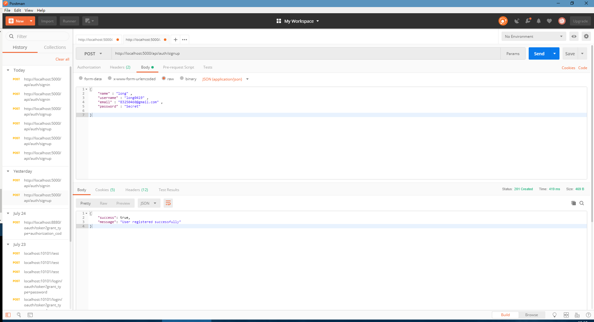
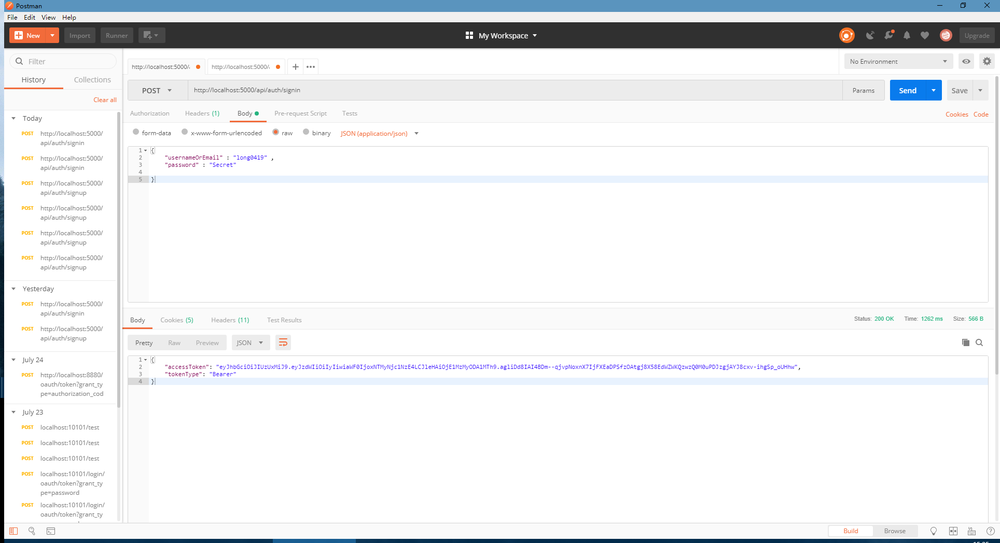

# MileWorks-Auth - 基于OAuth2 \ JWT 认证授权模块  
在研究Spring Cloud 框架一段时间之后，整个框架的系统认证、授权模块是其中一大核心功功能模块。在前后端分离之后，这个功能在整个系统中是可以单独剥离，并且可以独立运行。决定了整个系统资源使用、API调用的权限使用等等问题。

整理这套东西是基于前期研究了很多文章和代码之后总结的一套，并且是可以复用到任何微服务功能中去。

前期研究有代表性文章：
- [https://www.renren.io/guide](https://www.renren.io/guide)
- [https://segmentfault.com/a/1190000009164779](https://segmentfault.com/a/1190000009164779)
- [http://blueskykong.com/2017/10/19/security1/](http://blueskykong.com/2017/10/19/security1/)
- [https://blog.csdn.net/u012702547/article/details/54319508] (Spring security相关)

主流现在包括Java 、Go 语言中涉及Token相关的问题都会于JWT相关联处理。针对JWT相关的教程参考如下：  
-  [https://www.jdon.com/artichect/json-web-tokens.html](https://www.jdon.com/artichect/json-web-tokens.html)

大致流程如下：


其中在整个微服务中的定位：


### 现在针对现有工程进行说明解释：
- 系统结构如下：
```
MileWorks-Auth
├─src
│  ├─main
│  │  ├─java
│  │  │  └─com
│  │  │      └─mileworks
│  │  │          └─authsys
│  │  │              ├─config : Oauth相关配置
│  │  │              ├─controller : API 入口
│  │  │              ├─exception
│  │  │              ├─model
│  │  │              │  └─audit
│  │  │              ├─payload : 数据传输相关
│  │  │              ├─repository
│  │  │              ├─security : JWT 和 Oauth相关业务等处理
│  │  │              ├─service
│  │  │              └─util 
│  │  └─resources : 资源配置相关
│  │      ├─db
│  │      └─static
│  │          └─static
│  │              ├─css
│  │              ├─js
│  │              └─media
│  └─test
│      └─java
│          └─com
│              └─mileworks
│                  └─authsys

```

### 针对每块核心功能做详细介绍:  

>Note: 现有功能预览
- 构建API 通过用户名、邮箱、密码去注册新用户。
- 构建API 通过用户名、邮箱、密码去登陆。通过`校验`用户验证信息，API能生成`JWT授权`信息,并且返回值中返回相应token。
  客户端下次会将登陆成功返回的jwt token保存到本地，在每次请求访问受保护资源的时候在认证头部中`Authorization header`中带上`JWT token`信息。
- 配置 Spring security 中资源限制：
  * API中的login、signup 、静态资源（图片、js脚本、css）能被任何人访问。
  * API中的创建poll、vote等等 ，必须能被针对不同用户授权访问。
- 配置Spring security 中401 授权错误处理（当访问受保护资源但是请求时候没有JWT token）。
- 配置基于角色的认证资源服务器，比如：
  * 只有用户角色是ADMIN 能请求创建poll接口
  * 只有用户角色是USER 能投票

注意：项目相关注解不再一一解释，自行找百度君。

### 针对系统中关键部分做解释：
1. SecurityConfig : 整个工程的安全配置类  
   其中几个用到的关键注解和类：  

   * @EnableWebSecurity - 开启 web security 功能 
  
   * @EnableGlobalMethodSecurity - 方法级别的安全配置  
        securedEnabled ：针对controller/service  
        jsr250Enabled : 针对角色  
        prePostEnabled : 复杂表达式  

   * WebSecurityConfigurerAdapter:  
        实现spring security中WebSecurityConfigurer接口，通过实现这个接口，能自定义访问授权等。

   * CustomUserDetailsService：  
        用于授权当前角色用户拥有的操作。

   * JwtAuthenticationEntryPoint：  
        实现`AuthenticationEntryPoint `接口实现`commence()`方法。用于处理401 错误。

   * JwtAuthenticationFilter：  
        1. 从请求`Authorization header`头部读取JWT授权token信息。  
        2. 验证token。
        3. 通过token来过去用户详情信息。
        4. 保存用户详细信息到`SecurityContext`，能进行认证检查，然后能在controller 中的业务逻辑中使用。
   
    * AuthenticationManagerBuilder 和 AuthenticationManager: 
        1. `AuthenticationManagerBuilder`用于创建`AuthenticationManager`实例来针对用户鉴权。
        2. `AuthenticationManagerBuilder`能针对内存、LDAP、JDBC、自定义方式的鉴权。
        3. `AuthenticationManager`用于在登陆的时候针对用户进行授权。在这里使用自定义方式`customUserDetailsService` 和 `passwordEncoder`。

    * HttpSecurity :    
        针对`csrf` 、`sessionManagement` 、资源访问 。同时关联`JWTAuthenticationEntryPoint`和`JWTAuthenticationFilter`。  

    * UserPrincipal :  
        自定义UserDetails类，用于配合`UserDetailsService`类，来处理认证和授权操作。  
    
    * CustomUserDetailsService :  
        自定义UserDetailsService 类，让用户能通过用户名/邮箱来获取用户信息。
    
    * JwtTokenProvider :
        JWT工具类用于当用户登陆成功之后，验证在`Authorization header`中的JWT信息。  
        其中 JWT secret 和 expiration time在配置文件中。  

    * CurrentUser :  
        表明当前是已经授权的用户。  
    

### 测试对应的API ：  
- SignUp :
 

- Login
 


### 运行服务 ：

运行spring boot app 执行下面命令，然后服务启动端口在5000。

```shell
    mvn spring-boot:run
```
或者执行
```shell
    mvn package
    java -jar target/MileWorks-Auth-0.0.1-SNAPSHOT.jar
```
在数据库中添加授权角色`USER`和`ADMIN`，新用户默认分配`ROLE_USER`
```database
    INSERT INTO roles(name) VALUES('ROLE_USER');
    INSERT INTO roles(name) VALUES('ROLE_ADMIN');
```
